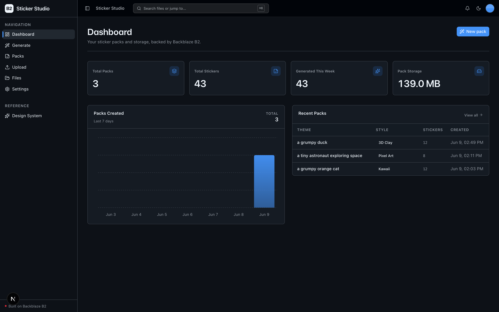
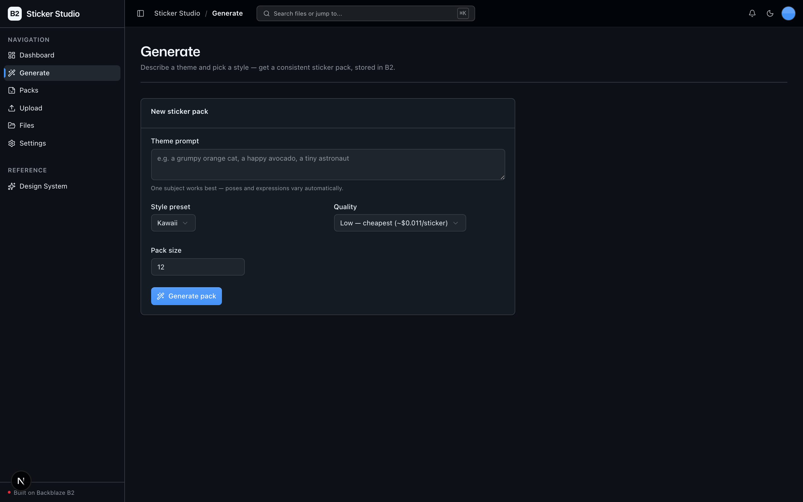
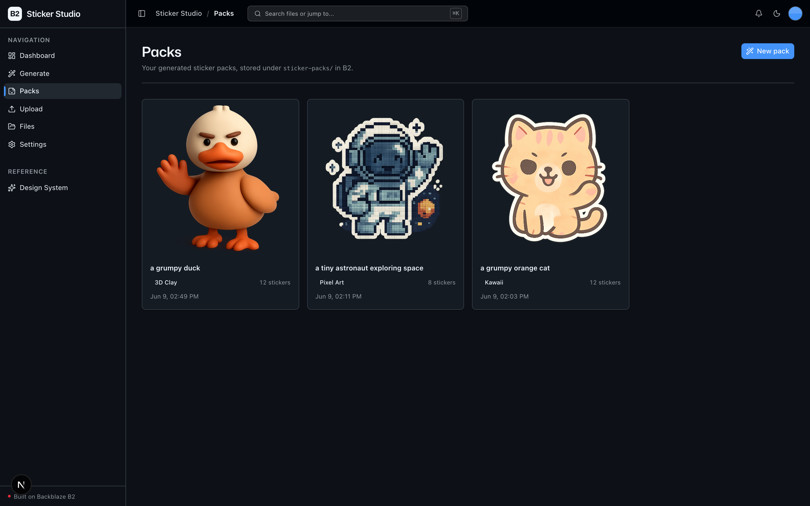
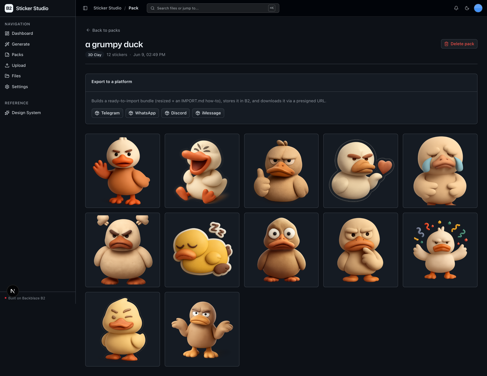

<!-- last_verified: 2026-06-09 -->
# AI Sticker Pack Generator

Generate themed **sticker / emoji packs in a consistent visual style** from a single text prompt, store every sticker and pack archive in **[Backblaze B2](https://www.backblaze.com/sign-up/ai-cloud-storage?utm_source=github&utm_medium=referral&utm_campaign=ai_artifacts&utm_content=b2ai-ai-sticker-pack-generator)**, and export ready-to-import bundles for **iMessage, Telegram, WhatsApp, and Discord**.

It's a lightweight, batteries-included sample for vibe coders and AI-app builders evaluating B2 as the storage layer for a *high-volume, accumulating* media workload: each pack is 12–30 images, packs pile up over time, and every artifact (individual stickers, the pack manifest, per-platform export ZIPs) lives in object storage — **no database**. One external API key (OpenAI), one new capability (image generation); the rest is the starter kit's B2-backed surface.

**What you get out of the box:**
- A `/generate` page: theme prompt + style preset + pack size + quality → a consistent pack of transparent, die-cut stickers
- A `/packs` library scoped to the `sticker-packs/` B2 prefix, with pack detail, per-sticker download, and per-platform export
- The full B2 file explorer (`/files`) and `/upload` (drop in your own reference images), kept from the starter
- FastAPI backend with strict layered architecture, structural tests, JSON logging, `/health`, and `/metrics`
- Agent-optimized docs — your AI coding agent can read the repo and start contributing immediately

## What it looks like

**Dashboard** — pack and sticker counts, generated-this-week and pack-storage metrics, a 7-day packs-created chart, and a recent-packs table.



**Generate** — a theme prompt plus style preset, quality, and pack-size controls that turn one description into a consistently-styled pack.



**Packs** — the library scoped to the `sticker-packs/` B2 prefix, each pack shown with its cover sticker, style, sticker count, and creation time.



**Pack detail** — open a pack to see every die-cut sticker in the set, plus one-tap export to Telegram, WhatsApp, Discord, or iMessage.



## Agent-First Architecture

This repo is optimized for coding agents. The structure follows the principle that **repository knowledge is the system of record** — everything an agent needs is versioned, co-located, and discoverable from the repo itself.

### How it works

**[AGENTS.md](AGENTS.md) is the single source of truth for all coding agents.** A compact entry point gives agents the repository layout, architectural invariants, commands, conventions, and pointers to deeper docs. Agent-specific files (CLAUDE.md, etc.) are thin pointers back to AGENTS.md.

**Architecture is enforced mechanically, not by convention.** Layering rules, import boundaries, file size limits, and SDK containment are verified by structural tests and lints on every change.

**The knowledge base is structured for progressive disclosure:**

```
AGENTS.md              Single source of truth — layout, invariants, commands, conventions
ARCHITECTURE.md        System layout, layering rules, data flows
docs/
  features/            Feature docs (generation, pack library, export, upload, browser, dashboard)
  app-workflows.md     User journeys
  dev-workflows.md     Engineering workflows and testing
  SECURITY.md          Security principles
  RELIABILITY.md       Reliability expectations
  exec-plans/          Execution plans and tech debt tracker
```

## Quick Start

You need: Node.js >= 20, pnpm >= 9, Python >= 3.11, a free **[Backblaze B2 account](https://www.backblaze.com/sign-up/ai-cloud-storage?utm_source=github&utm_medium=referral&utm_campaign=ai_artifacts&utm_content=b2ai-ai-sticker-pack-generator)**, and an **OpenAI API key**.

### Setup

**1. Install dependencies**

```bash
pnpm install
```

**2. Set up the backend**

```bash
cd services/api
python -m venv .venv && source .venv/bin/activate
pip install -r requirements.txt
cd ../..
```

**3. Add your credentials**

```bash
cp .env.example .env
```

Open `.env` in your editor. Then head to the [Backblaze B2 dashboard](https://secure.backblaze.com/b2_buckets.htm?utm_source=github&utm_medium=referral&utm_campaign=ai_artifacts&utm_content=b2ai-ai-sticker-pack-generator) and:

1. **Create a bucket.** B2 shows two values — paste each into `.env`:
   - **Bucket Unique Name** → `B2_BUCKET_NAME`
   - **Endpoint** → `B2_ENDPOINT`
   - (Optional) the region embedded in the endpoint → `B2_REGION` — leave blank to let the S3 client infer it.
2. **Create an application key** with `Read and Write` permission. B2 shows two values — paste each into `.env`:
   - **keyID** → `B2_APPLICATION_KEY_ID`
   - **applicationKey** → `B2_APPLICATION_KEY` *(only shown once — paste it now)*
3. **Add your OpenAI key** → `OPENAI_API_KEY`. This is used **server-side only** to call the image-generation model and is never exposed to the browser.

> Want a walkthrough? See the docs for [creating a bucket](https://www.backblaze.com/docs/cloud-storage-create-and-manage-buckets?utm_source=github&utm_medium=referral&utm_campaign=ai_artifacts&utm_content=b2ai-ai-sticker-pack-generator) and [creating app keys](https://www.backblaze.com/docs/cloud-storage-create-and-manage-app-keys?utm_source=github&utm_medium=referral&utm_campaign=ai_artifacts&utm_content=b2ai-ai-sticker-pack-generator).

> **OpenAI setup gotcha:** the sticker model `gpt-image-1` may require **organization verification** on some OpenAI accounts before it can be used. If generation returns an authorization error, verify your org in the OpenAI dashboard.

**4. Run it**

```bash
pnpm dev
```

Frontend at `localhost:3000`, API at `localhost:8000`. Go to **Generate**, describe a theme (e.g. "a grumpy orange cat"), pick a style, and create your first pack.

`pnpm dev` runs `pnpm doctor` first — a preflight check that catches the common setup gotchas (wrong Node/Python version, missing venv, missing or placeholder `.env`, missing `OPENAI_API_KEY`, ports already taken) and tells you how to fix each one. Run it standalone any time with `pnpm doctor`.

### Cost note

The default run — **12 stickers at `low` quality** — costs roughly **$0.15** (~$0.011/image), well under $1. Quality and pack size are the cost levers and are surfaced in the UI. A 30-sticker pack at `medium`/`high` can exceed $1, so the demo defaults are capped at `low` quality and a 16-sticker safe size; larger/higher is opt-in with an in-UI cost note.

## Building On This App

This app forks the **vibe-coding-starter-kit**. The reusable scaffolding stays; only the dashboard and the sticker-specific surface are app-specific:

- **Kept** the UI kit (`apps/web/src/components/ui/` + design tokens in `globals.css` + `/design`), the full-bucket File Explorer (`/files`), and Upload (`/upload`).
- **Adapted** the Dashboard (`/`) to sticker metrics.
- **Added** Generate (`/generate`), the scoped Packs library (`/packs`, `/packs/[id]`), and the backend generation/export/library layer.

Full contract and rationale: [AGENTS.md §2](AGENTS.md#2-app-surface-forked-from-vibe-coding-starter-kit).

## Core Features

- [Sticker Generation](docs/features/sticker-generation.md) — one prompt + a style preset → N consistently-styled transparent stickers
- [Pack Library](docs/features/sticker-packs.md) — scoped `/packs` explorer over the `sticker-packs/` B2 prefix, with pack detail
- [Pack Export](docs/features/pack-export.md) — per-platform ZIP bundles (Telegram, WhatsApp, Discord, iMessage)
- [Dashboard](docs/features/dashboard.md) — pack/sticker metrics, packs-per-day chart, recent packs
- [File Upload](docs/features/file-upload.md) — drag-and-drop upload (drop in your own reference images)
- [File Browser](docs/features/file-browser.md) — full-bucket list, preview, download, delete
- [Metadata Extraction](docs/features/metadata-extraction.md) — image dimensions, EXIF, PDF info, checksums
- B2-backed, no database — every artifact lives in object storage

## Tech Stack

- TypeScript, Next.js 16, React 19, Tailwind v4, shadcn/ui, Recharts
- TanStack Query — caching, dedup, retry, stale-while-revalidate for every fetch
- Python 3.11+, FastAPI, boto3, Pydantic v2, Pillow, PyPDF2, OpenAI
- Backblaze B2 (S3-compatible object storage)
- OpenAI `gpt-image-1` (image generation, transparent backgrounds)
- pnpm workspaces (monorepo)

## Commands

| Command | What it does |
|---------|-------------|
| `pnpm dev` | Start frontend + backend |
| `pnpm dev:web` | Frontend only |
| `pnpm dev:api` | Backend only |
| `pnpm build` | Build frontend |
| `pnpm lint` | Lint frontend |
| `pnpm lint:api` | Lint backend (ruff) |
| `pnpm test:api` | Run backend tests |
| `pnpm check:structure` | Verify layering rules |
| `pnpm test:e2e` | Playwright e2e tests (run `pnpm --filter @ai-sticker-pack-generator/web exec playwright install chromium` once first) |

## Documentation Map

| Doc | Purpose |
|-----|---------|
| [AGENTS.md](AGENTS.md) | Agent table of contents — start here |
| [ARCHITECTURE.md](ARCHITECTURE.md) | System layout, layering, data flows |
| [docs/features/](docs/features/) | Feature docs |
| [docs/design-system.md](docs/design-system.md) | Design tokens, primitives, AI elements, loader, error/empty states |
| [docs/app-workflows.md](docs/app-workflows.md) | User journeys |
| [docs/dev-workflows.md](docs/dev-workflows.md) | Engineering workflows and testing |
| [docs/SECURITY.md](docs/SECURITY.md) | Security principles |
| [docs/RELIABILITY.md](docs/RELIABILITY.md) | Reliability expectations |
| [docs/exec-plans/](docs/exec-plans/) | Execution plans and tech debt tracker |

## License

MIT License - see [LICENSE](LICENSE) for details.

## Claude Agent B2 Skill

Manage Backblaze B2 from your terminal using natural language (list/search, audits, stale or large file detection, security checks, safe cleanup).

Repo: [https://github.com/backblaze-b2-samples/claude-skill-b2-cloud-storage](https://github.com/backblaze-b2-samples/claude-skill-b2-cloud-storage)
